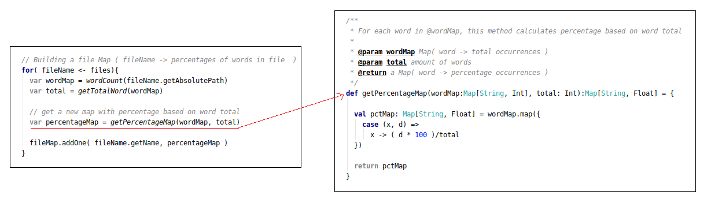

# WordCounter

Pequeño programa encargado de listar en orden descendiente los ficheros con mayor porcentaje de apariciones de una palabra dada.

## Installation

Usar el compilador de scala para generar el .class ejecutable.

```bash
scalac WordCounter.scala
```
Y a continuación, invocar el objeto WordCounter pasando un el nombre del folder que contiene los ficheros (Ej: /home/orlando/test_files, desde unix): 
```bash
scala WordCounter mis_archivos
```
_mis_archivos_ es un director incorporado en el desarrollo que tiene 20 ficheros generados con lorem ipsum y en los que adicionalmente se han puesto aleatoriamente las palabras 'casa', 'coche', 'perro', 'gato', 'arbol', 'radio' y 'calle'.

## Ejemplos de uso


## Descripción de Funcionamiento

Antes de detallar el funcionamiento se mencionan algunas consideraciones:

- El nombre del fichero debe ser pasado como argumento al momento de ejecutar WordCounter
- Las palabras que son consideradas como tal son aquellos segmentos de texto separados por espacio o salto de línea
- La búsqueda es _case sentive_ y por tanto 'Casa' y 'casa' son distintas palabras; Las tildes también pueden diferenciar una palabra de otra, por tanto "esta" y "está" también son palabras diferentes.
- Para salir del prompt se debe escribir 'quit'.

### Funcionamiento
Para cada uno de los ficheros del folder: 

 - El primer paso consiste crear un Map (llamado 'wordMap') que almacena cada palabra (key) asociado al número de ocurrencias de la misma (value).

    

 - En seguida, se obtiene el total de palabras de el fichero sumando todos los valores del Map 'wordMap'

    

 - Teniendo el total anterior y el número de ocurrencias de cada palabra (wordMap) es posible calcular el porcentaje de apariciones de cada palabra. Estos porcentajes se guardan en un Map llamado 'percentageMap', cuyas claves son las palabras y los valores correspondientes es el porcentaje de ocurrencias.

    

 - Este último Map es a su vez almacenado en otro Map ('fileMap') que lo asocia con el nombre de archivo al que pertenece. El nombre del fichero es la clave de es nuevo Map.


Con todos los ficheros del directorio ya procesados, entonces: 

 - Se utiliza la palabra de búsqueda ('targetWord') para filtrar de 'fileMap' todos los ficheros que contienen la palabra y guardarlos en la colección 'filteredtMap'

    

 - 'filteredtMap' es ordenada descendentemente y de esta se toman los N-primeros elementos que luego son enseñados al usuario.

    

## License
[Licencia GNU LGPL](https://es.wikipedia.org/wiki/GNU_Lesser_General_Public_License)